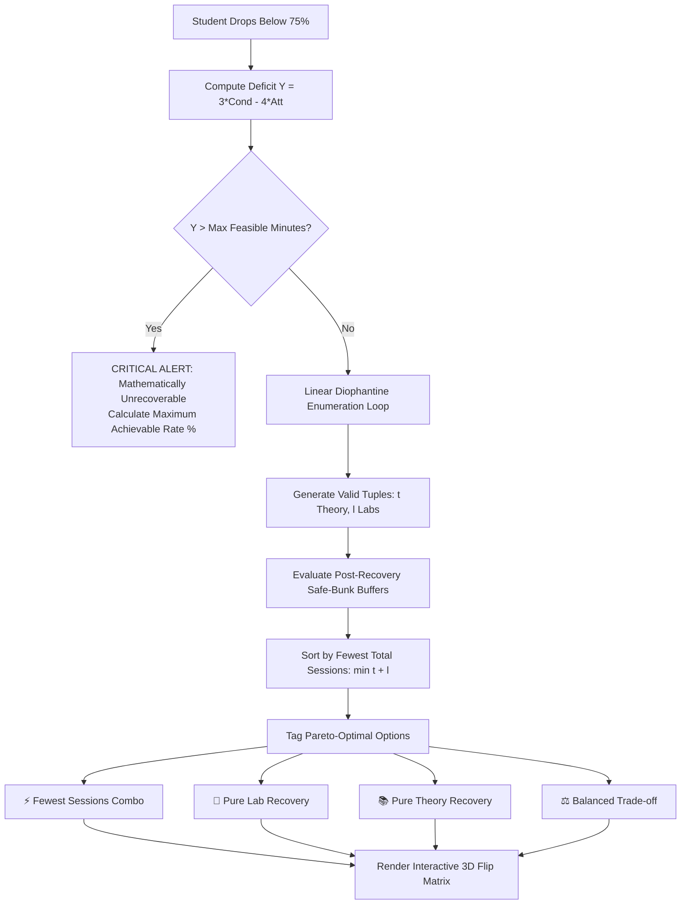

<div align="center">

```
██████╗ ██╗   ██╗███╗   ██╗██╗  ██╗██╗    ██╗██╗███████╗███████╗
██╔══██╗██║   ██║████╗  ██║██║ ██╔╝██║    ██║██║██╔════╝██╔════╝
██████╔╝██║   ██║██╔██╗ ██║█████╔╝ ██║ █╗ ██║██║███████╗█████╗  
██╔══██╗██║   ██║██║╚██╗██║██╔═██╗ ██║███╗██║██║╚════██║██╔══╝  
██████╔╝╚██████╔╝██║ ╚████║██║  ██╗╚███╔███╔╝██║███████║███████╗
╚═════╝  ╚═════╝ ╚═╝  ╚═══╝╚═╝  ╚═╝ ╚══╝╚══╝ ╚═╝╚══════╝╚══════╝
```

### The Deterministic Attendance & Tactical Bunk Recovery Engine

*Engineered for university students facing strict 75% attendance criteria.*  
*Models the non-linear 2.09× penalty of 115-minute laboratory sessions and solves linear mixed-recovery combinations.*

<br/>

[](https://react.dev/)
[](https://vitejs.dev/)
[](https://tailwindcss.com/)
[](https://greensock.com/gsap/)
[](#-automated-verification-suite-122-tests)
[](#-local-first--zero-telemetry-architecture)
[](LICENSE)

<br/>

[**Live Application**](https://aashraygalav.github.io/BUNKWISE-A-College-Attendance-Manager/) • [**Mathematical Formulation**](#-the-mathematics-of-attendance) • [**Mixed Recovery Solver**](#-mixed-mode-recovery-planner-algorithm) • [**Canvas Physics Field**](#-ambient-dot-field-canvas-physics) • [**Quickstart**](#-quickstart)

</div>

---

## ⚡ The Problem: Why Naive Attendance Trackers Fail

Every generic attendance tracker on the internet makes a fatal assumption:

$$\text{Attendance Rate} = \frac{\text{Classes Attended}}{\text{Classes Conducted}}$$

In modern university STEM curricula, this formula is **academically catastrophic**. Classes do not carry equal weight:

| Session Type | Duration | Contact Weight | Impact Ratio |
| :--- | :---: | :---: | :---: |
| **Theory Lecture** | **55 minutes** | $0.917\text{ hours}$ | $1.00\times$ |
| **Laboratory Session** | **115 minutes** | $1.917\text{ hours}$ | **$\mathbf{2.0909\times}$** |

$$\text{Weight Ratio} = \frac{115\text{ min}}{55\text{ min}} \approx 2.0909\times$$

> **The 2.09× Asymmetry**: Missing a single 115-minute lab inflicts **more attendance damage than missing two consecutive theory lectures**. Conversely, attending a lab recovers attendance more than twice as fast. 
> 
> Naive attendance apps count "1 class = 1 class", giving students a false sense of security right before they get debarred. **BunkWise computes attendance strictly using contact learning minutes.**

---

## 🖥️ Tactical Cockpit Blueprint

```
┌──────────────────────────────────────────────────────────────────────────────────┐
│ BUNKWISE COCKPIT HUD v2.0                                [STATUS: TACTICAL SAFE] │
├──────────────────────────────────────────────────────────────────────────────────┤
│ AGGREGATE HEALTH: 84.6%     TOTAL HOURS: 142.5h / 168.0h     BUFFER: +18.2 HOURS │
├──────────────────────────────────────────────────────────────────────────────────┤
│                                                                                  │
│  [ADVANCED COMPILER DESIGN] ──── CS402 ──── THEORY (55m) + LAB (115m)            │
│  ┌─────────────────────────┬───────────────────────────────────────────────────┐ │
│  │ CURRENT: 68.4% (DEFICIT)│ [FLIP CARD: 3D TACTICAL RECOVERY MATRIX]          │ │
│  │ 42 Conducted / 28 Att   │                                                   │ │
│  │ Deficit: -165 min       │ ⚡ FEWEST SESSIONS : 1 Theory + 3 Labs (4 total)   │ │
│  │ Safe Skips Today: 0     │ 🔬 PURE LAB PATH   : 0 Theory + 4 Labs (4 total)   │ │
│  │ Sem Max Allowance: 4    │ 📚 PURE THEORY     : 8 Theory + 0 Labs (8 total)   │ │
│  │ Trend: +1.4% (Attended) │ ⚖️ BALANCED COMBO  : 3 Theory + 2 Labs (5 total)   │ │
│  └─────────────────────────┴───────────────────────────────────────────────────┘ │
│                                                                                  │
│  HUD GAUGES: [Circular SVG Dials]  •  [Kinetic Particle Ambient Field @ 60 FPS]  │
│  AUDIO HAPTICS: Synthesized 800Hz / 440Hz / 220Hz harmonic feedback on action   │
└──────────────────────────────────────────────────────────────────────────────────┘
```

---

## 📐 The Mathematics of Attendance

### 1. Contact Minute Calculus
For any course with attended theory sessions $A_T$, missed theory sessions $M_T$, attended lab sessions $A_L$, and missed lab sessions $M_L$:

$$\text{AttendedMinutes} = 55 \cdot A_T + 115 \cdot A_L$$

$$\text{ConductedMinutes} = 55 \cdot (A_T + M_T) + 115 \cdot (A_L + M_L)$$

$$\text{Attendance \%} = \begin{cases} 
100.0\% & \text{if } \text{ConductedMinutes} = 0 \\ 
\left(\dfrac{\text{AttendedMinutes}}{\text{ConductedMinutes}}\right) \times 100 & \text{if } \text{ConductedMinutes} > 0 
\end{cases}$$

---

### 2. Safe Bunk Horizon Buffer (When Attendance $\ge 75\%$)
The system calculates the exact minute surplus $B$ before the student crosses below the mandatory 75% threshold ($\theta = 0.75$):

$$B = \left\lfloor \frac{\text{AttendedMinutes}}{0.75} - \text{ConductedMinutes} \right\rfloor$$

From the surplus buffer $B$, BunkWise provides dual deterministic skip allowances:

$$\text{SafeTheorySkips} = \min\left(\text{Remaining}_T,\, \left\lfloor \frac{B}{55} \right\rfloor\right)$$

$$\text{SafeLabSkips} = \min\left(\text{Remaining}_L,\, \left\lfloor \frac{B}{115} \right\rfloor\right)$$

---

### 3. Shortage Deficit Formulation (When Attendance $< 75\%$)
To recover from an attendance deficit to $\ge 75\%$, the required additional attended contact minutes $Y$ must satisfy:

$$\frac{\text{AttendedMinutes} + Y}{\text{ConductedMinutes} + Y} \ge 0.75 \implies Y = \max\left(0,\, \left\lceil 3 \cdot \text{ConductedMinutes} - 4 \cdot \text{AttendedMinutes} \right\rceil\right)$$

---

## 🧠 Mixed-Mode Recovery Planner Algorithm

When a student falls below 75%, naive apps suggest a single number like *"Attend 7 classes"*. But what if the semester has 3 labs and 4 theory classes left? What is the most time-efficient path?

BunkWise runs an exhaustive **Integer Linear Programming (ILP) Solver** over the Diophantine inequality:

$$\text{Find all } (t, l) \in \mathbb{N}_0 \times \mathbb{N}_0 \quad \text{such that} \quad 55t + 115l \ge Y$$

$$\text{Subject to:} \quad 0 \le t \le \text{Remaining}_T, \quad 0 \le l \le \text{Remaining}_L$$



### Pareto Optimization & Categorization
Every generated combination $(t, l)$ is evaluated for:
1. **Total Session Footprint**: $S = t + l$
2. **Buffer Efficiency**: Post-recovery minute surplus $B_{\text{post}} = \lfloor \frac{\text{Attended} + 55t + 115l}{0.75} - (\text{Conducted} + 55t + 115l) \rfloor$
3. **Smart Badging**:
   - `Fewest Sessions`: $\min(t + l)$ (fastest physical calendar recovery)
   - `Pure Lab`: $t = 0$ (minimal days on campus)
   - `Pure Theory`: $l = 0$ (zero lab requirements)
   - `Balanced`: Optimal trade-off between theory and lab

### Unreachability Detection
If $Y > 55 \cdot \text{Remaining}_T + 115 \cdot \text{Remaining}_L$, BunkWise flags the course as **MATHEMATICALLY UNRECOVERABLE** and displays the exact upper bound:

$$\text{MaxAchievable\%} = \left(\frac{\text{Attended} + 55 \cdot \text{Remaining}_T + 115 \cdot \text{Remaining}_L}{\text{Conducted} + 55 \cdot \text{Remaining}_T + 115 \cdot \text{Remaining}_L}\right) \times 100\%$$

---

## 🌌 Ambient Dot Field: Canvas Physics

BunkWise features a custom-engineered HTML5 canvas particle environment running a real-time kinetic physics simulation.

```
       [Mouse Cursor]
             *
          .-' | '-.       Repulsion Field (Radius R = 280px)
        .'    |    '.     Inverse-Square Falloff: F ∝ 1 / (1 + (d/R)²)
       /      |      \
      ;       v       ;
     :     (Particle)  :
      \       |       /   Velocity Damping: v(t+1) = v(t) * 0.94
       '.     v     .'    Spring Restoration: F_spring = -k * (x - x_anchor)
         '-.  |  .-'
             'v'
```

### Simulation Specifications:
- **Particle Budget**: 280–420 high-DPI particles on desktop, dynamically scaled to viewport area.
- **Color Palette**: Off-white dots (`rgba(255, 255, 255, 0.40)`) rendered over a deep charcoal substrate (`#0d0e12`).
- **Interaction Radius**: $280\text{px}$ repulsion envelope with smooth quadratic attenuation.
- **Kinetic Restoration**: Damped harmonic oscillator returning each particle to its origin coordinate ($k = 0.035$, friction $\mu = 0.94$).
- **Zero-Waste Battery Lifecycle**: Incorporates idle sleep detection. If the cursor is stationary for $>2.5\text{ seconds}$, the `requestAnimationFrame` loop suspends execution until the next pointer event, reducing idle GPU consumption to **0%**.

---

## 🔊 Procedural Web Audio Synthesis

Zero external audio assets (`.mp3` or `.wav`). Every auditory feedback cue is synthesized in real time using the browser's native `AudioContext`:

```javascript
// Example: Synthesizing a crisp tactile haptic pulse (800Hz -> 200Hz)
const ctx = new (window.AudioContext || window.webkitAudioContext)();
const osc = ctx.createOscillator();
const gain = ctx.createGain();

osc.type = 'sine';
osc.frequency.setValueAtTime(800, ctx.currentTime);
osc.frequency.exponentialRampToValueAtTime(200, ctx.currentTime + 0.04);

gain.gain.setValueAtTime(0.08, ctx.currentTime);
gain.gain.exponentialRampToValueAtTime(0.001, ctx.currentTime + 0.04);

osc.connect(gain);
gain.connect(ctx.destination);
osc.start();
osc.stop(ctx.currentTime + 0.04);
```

| Event | Waveform | Frequency Modulation | Duration | Semantic Purpose |
| :--- | :---: | :---: | :---: | :--- |
| **Tactile Tap** | Sine | $800\text{Hz} \to 200\text{Hz}$ | $40\text{ms}$ | Attendance log increment |
| **Undo / Revert** | Triangle | $350\text{Hz} \to 180\text{Hz}$ | $60\text{ms}$ | Operation reversal |
| **Card 3D Flip** | Sine | $440\text{Hz} \to 660\text{Hz}$ | $80\text{ms}$ | Recovery matrix inspection |
| **Threshold Alert** | Sawtooth | $220\text{Hz} \to 180\text{Hz}$ | $140\text{ms}$ | Sub-75% debarment warning |
| **Target Reached** | Arpeggio | $523.25\text{Hz} \to 659.25\text{Hz} \to 783.99\text{Hz}$ | $200\text{ms}$ | 75% criteria attainment |

---

## 🔒 Local-First & Zero-Telemetry Architecture

BunkWise adheres to a strict **privacy-first, local-first paradigm**:

- **No Remote Servers**: Zero backend APIs, zero databases, zero cloud dependencies.
- **Zero Telemetry**: No Google Analytics, no trackers, no session recordings, no external beacon requests.
- **Atomic Local Persistence**: Real-time state synchronization via a single transactional `localStorage` key (`bunkwise_attendance_v3`).
- **Portable JSON Backups**: Full schema export and import functionality to backup or migrate attendance profiles across devices with zero data lock-in.

---

## 🧪 Automated Verification Suite (122 Tests)

The core mathematical engine is verified by **122 automated unit tests** across two comprehensive test harnesses:

```
===========================================================
RUNNING BUNKWISE MIXED RECOVERY GENERATOR TEST SUITE (18)
===========================================================
Scenario 1:  Already Above 75%                      ✓ PASS (3/3)
Scenario 2:  Exactly 75% Boundary                   ✓ PASS (3/3)
Scenario 3:  Theory-Only Recovery                   ✓ PASS (5/5)
Scenario 4:  Lab-Only Recovery Option               ✓ PASS (3/3)
Scenario 5:  Mixed Recovery Combinations            ✓ PASS (3/3)
Scenario 6:  Multiple Valid Combinations            ✓ PASS (2/2)
Scenario 7:  Single Valid Combination               ✓ PASS (2/2)
Scenario 8:  Unrecoverable State Detection          ✓ PASS (3/3)
Scenario 9:  Theory Session Constraints             ✓ PASS (1/1)
Scenario 10: Lab Session Constraints                ✓ PASS (1/1)
Scenario 11: Dual Session Constraints               ✓ PASS (1/1)
Scenario 12: Exact 75.0% Integer Boundary           ✓ PASS (3/3)
Scenario 13: Just-Above 75.0% Sensitivity           ✓ PASS (2/2)
Scenario 14: Sub-75% Integrity Guard                ✓ PASS (1/1)
Scenario 15: Large Shortage Stress Test             ✓ PASS (1/1)
Scenario 16: Decimal Learning Hours Handling        ✓ PASS (2/2)
Scenario 17: Post-Recovery Buffer Verification      ✓ PASS (37/37)
Scenario 18: Pareto Order & Fewest Sessions         ✓ PASS (14/14)
TOTAL: 87 | PASSED: 87 | FAILED: 0

=====================================================
RUNNING BUNKWISE ATTENDANCE ENGINE VERIFICATION TESTS
=====================================================
Test 1:  55m / 115m Ratio Constants (2.09x)         ✓ PASS (3/3)
Test 2:  Zero Conducted Classes Initialization      ✓ PASS (4/4)
Test 3:  SAFE State Minute Buffers                  ✓ PASS (5/5)
Test 4:  Borderline CAUTION Thresholds              ✓ PASS (4/4)
Test 5:  Weighted Theory + Lab Calculation          ✓ PASS (3/3)
Test 6:  Shortage Recovery Planning (AT RISK)       ✓ PASS (5/5)
Test 7:  CRITICAL Unrecoverable Alert               ✓ PASS (3/3)
Test 8:  Two-Decimal Floating Precision             ✓ PASS (2/2)
Test 9:  Projection Simulator Matrix                ✓ PASS (3/3)
Test 10: Multi-Session Combined Scenarios           ✓ PASS (3/3)
TOTAL: 35 | PASSED: 35 | FAILED: 0

==================================================================
COMBINED ENGINE VERIFICATION: 122 / 122 TESTS PASSING (100%) 🎯
==================================================================
```

Run the automated test harnesses locally:

```bash
# Run mixed theory + lab recovery suite
node test_mixed_recovery.js

# Run core contact-minute engine suite
node test_attendance_engine.js
```

---

## 🛠️ Technology Stack

| Layer | Technology | Purpose |
| :--- | :--- | :--- |
| **UI Framework** | **React 19** (`19.0.0`) | Modern concurrent reactive rendering & component state |
| **Build Engine** | **Vite 6** (`6.2.0`) | Lightning-fast HMR and optimized tree-shaken bundling |
| **Styling** | **Tailwind CSS 3.4** | Design tokens, glassmorphic filters, and fluid responsiveness |
| **Animations** | **GSAP 3.12** | Smooth layout tweens and timeline-controlled UI transitions |
| **Graphics** | **HTML5 Canvas** | Custom 60fps kinetic particle field simulation |
| **Audio** | **Web Audio API** | Procedural frequency synthesis and tactile sonic feedback |
| **Icons** | **Lucide React** | Consistent, lightweight vector iconography |
| **Celebrations**| **Canvas Confetti** | Milestone achievement feedback upon reaching 75% target |

---

## 🚀 Quickstart

### Prerequisites
- [Node.js](https://nodejs.org/) ($\ge \text{v18.0.0}$)
- `npm` or `pnpm` or `yarn`

### Installation & Setup

```bash
# 1. Clone repository
git clone https://github.com/aashraygalav/BUNKWISE-A-College-Attendance-Manager.git

# 2. Enter project directory
cd BUNKWISE-A-College-Attendance-Manager

# 3. Install dependencies
npm install

# 4. Start local development server
npm run dev
```

Open [http://localhost:5173](http://localhost:5173) in your browser.

### Production Build

```bash
# Build optimized production assets
npm run build

# Preview production build locally
npm run preview
```

---

## 📂 Project Structure

```
BUNKWISE-A-College-Attendance-Manager/
├── src/
│   ├── components/
│   │   ├── dashboard/
│   │   │   ├── AddEditModal.jsx           # Subject creation & configuration
│   │   │   ├── AmbientDotField.jsx        # Canvas particle physics engine
│   │   │   ├── AttendanceDashboard.jsx    # Cockpit HUD & stats aggregator
│   │   │   ├── RecoveryPlannerModal.jsx   # Dedicated mixed recovery inspector
│   │   │   ├── ScenarioSimulatorModal.jsx # What-If projection sandbox
│   │   │   ├── SettingsModal.jsx          # JSON data backup, import & export
│   │   │   ├── SubjectCard.jsx            # 3D Flip Card with live recovery matrix
│   │   │   └── TodaysLogModal.jsx         # Batch daily logging interface
│   │   ├── Features.jsx                   # Feature highlight presentation
│   │   ├── Footer.jsx                     # Engineering credits & links
│   │   ├── Hero.jsx                       # High-impact typographic hero
│   │   ├── Navbar.jsx                     # Glassmorphic header & sound toggle
│   │   ├── Philosophy.jsx                 # The 2.09x ratio rationale
│   │   └── Protocol.jsx                   # Student operational workflow
│   ├── engine/
│   │   ├── AttendanceCalc.js              # Diophantine recovery solver & minute engine
│   │   ├── AttendanceStore.js             # LocalStorage state management
│   │   └── SoundFX.js                     # Procedural Web Audio synthesizer
│   ├── App.jsx                            # Root application composition
│   ├── index.css                          # Custom typography & glassmorphism tokens
│   └── main.jsx                           # Application entry point
├── test_attendance_engine.js              # 35 engine verification tests
├── test_mixed_recovery.js                 # 87 mixed recovery solver tests
├── tailwind.config.js                     # Tailwind configuration
├── vite.config.js                         # Vite build configuration
├── package.json                           # Metadata & dependencies
└── README.md                              # Master technical documentation
```

---

## 📜 The Student's Manifesto

> *"Attendance is not a moral virtue; it is a constrained resource optimization problem.*  
> *Do not guess. Do not hope. Calculate."*

---

## 👨‍💻 Author

**Aashray Galav**  
*Computer Science & Engineering*  
[GitHub Profile](https://github.com/aashraygalav) • [Project Repository](https://github.com/aashraygalav/BUNKWISE-A-College-Attendance-Manager)

---

## 📄 License

Distributed under the **MIT License**. See `LICENSE` for more information.
